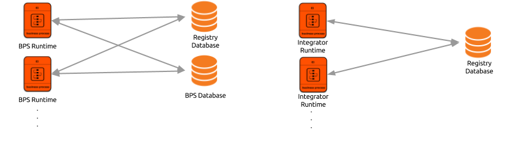
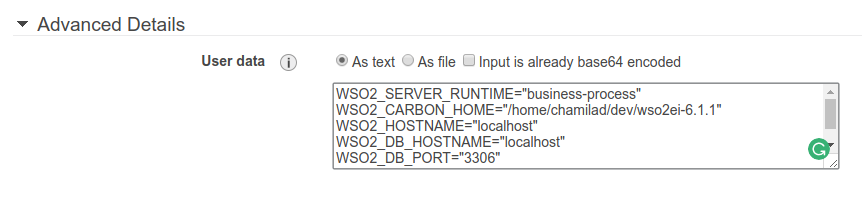

# WSO2 EI 6.1.1 Bootstrap Script
This script configures different runtimes in WSO2 Enterprise Integrator 6.1.1.



## Supported Runtimes
1. WSO2 EI Integrator
2. WSO2 EI BPS

## How To
1. Download and extract the WSO2 EI 6.1.1 distribution. This location would be the value to be used in the configuration option `WSO2_CARBON_HOME`.
2. Download JDK 1.8 and setup `JAVA_HOME`. Optionally add `$JAVA_HOME/bin` to `$PATH`.
3. Clone this repository to a preferred location.
```bash
git clone https://github.com/chamilad/wso2ei-conf.git
```
4. Download any JDBC drivers and other external libraries that are needed to be copied over to `CARBON_HOME` and place them inside the `files` folder as described in the section [Copying Files](#copying-files).
  * [MySQL JDBC Driver](https://dev.mysql.com/downloads/connector/j/)
  * [Postgres JDBC Driver](https://jdbc.postgresql.org/download.html)

  ```bash
  # Example: Download and copy the PostgreSQL JDBC Driver to all the runtimes when configuring.

  # 1. Create the intended folder structure relative to CARBON_HOME
  cd wso2ei-conf
  mkdir -p files/common/lib

  # 2. Download the JDBC Driver
  wget https://jdbc.postgresql.org/download/postgresql-42.1.4.jar -P files/common/lib
  ```
5. Setup databases as described in the section [Database Configuration](#database-configuration).
6. **OPTIONAL:** Setup any load balancers that would front these instances.
> If any load balancers are created, configurations `WSO2_HOSTNAME`, `WSO2_HTTP_PROXY_PORT`, and `WSO2_HTTPS_PROXY_PORT` will have to be set

7. Set necessary environment variables as described in the following section (scripting the configuration options is described in [another section](#running-the-setupsh)).
8. Run `setup.sh` file.

## Detailed How-to
### Configuration Options
The configuration options are extracted from environment variables.

1. `WSO2_SERVER_RUNTIME` - The runtime id of the server.
  * WSO2 EI BPS - `business-process`
  * WSO2 EI Integrator - `integrator`
2. `WSO2_CARBON_HOME` - The location where the WSO2 Server is located
3. `WSO2_HOSTNAME` - The hostname to be used in the WSO2 servers
4. `WSO2_DB_HOSTNAME` - The hostname of the DB server
5. `WSO2_DB_PORT` - The port at which the DB server is operating
6. `WSO2_DB_NAME` - The database name
7. `WSO2_DB_PROTOCOL` - The JDBC URL Protocol to use. This would use a default value of `mysql`
  * MySQL - `mysql`
  * Postgres - `postgresql`
8. `WSO2_DB_DRIVER_NAME` - The JDBC driver name to be used in the datasources. This would use a default value of `com.mysql.jdbc.Driver`
  * MySQL - `com.mysql.jdbc.Driver`
  * Postgres - `org.postgresql.Driver`
9. `WSO2_DB_USERNAME` - The username to access the DB
10. `WSO2_DB_PASSWORD` - The password to access the DB
11. `WSO2_SERVER_ARGS` - Arguments to pass to the WSO2 Server starter script
12. `WSO2_HTTP_PROXY_PORT` - The `proxyPort` value to be used for the HTTP port. These values, if present, would be used in `catalina-server.xml` file.
13. `WSO2_HTTPS_PROXY_PORT` - The `proxyPort` value to be used for the HTTPS port. These values, if present, would be used in `catalina-server.xml` file.

Following is a sample set of values that configure a WSO2 EI 6.1.1 instance with the following parameters.
1. **Product**: WSO2 EI 6.1.1 PS
2. **DB**: Postgres (preconfigured)
3. **DB Host**: `localhost`
4. **Load balancer setup**: true

```bash
export WSO2_SERVER_RUNTIME="business-process"
export WSO2_CARBON_HOME="/home/chamilad/dev/wso2ei-6.1.1"
export WSO2_HOSTNAME="localhost"
export WSO2_DB_HOSTNAME="localhost"
export WSO2_DB_PORT="5432"
export WSO2_DB_NAME="WSO2BPS_DB"
export WSO2_DB_USERNAME="postgres"
export WSO2_DB_PASSWORD="postgres"
export WSO2_SERVER_ARGS=""
export WSO2_DB_DRIVER_NAME="org.postgresql.Driver"
export WSO2_DB_PROTOCOL="postgresql"
export WSO2_HTTP_PROXY_PORT="80"
export WSO2_HTTPS_PROXY_PORT="443"
```

### Database Configuration
This script expects the database to be already created and populated with the initial source scripts. If this cannot be done, the option to setup databases automatically when the product starts can be followed. For this, pass the `-Dsetup` system property to the WSO2 Server starter script.

```bash
cd $CARBON_HOME/bin
./business-process.sh -Dsetup
```

If this system property is passed, WSO2 Carbon will execute the relevant database scripts on top of the databases specified. However, this would not always result in expected state, especially if the databases specified are not empty.

`WSO2_SERVER_ARGS` can be used to pass `-Dsetup` argument into the script.

```bash
export WSO2_SERVER_ARGS="-Dsetup"
```

> Please note that using `-Dsetup` is not recommended for a production environment. Properly setting up databases should be done with database scripts that are shipped with the product, on which the next section elaborates on.

#### Setting up the Database
For each runtime, the initial database scripts are shipped with the product. These would be inside `CARBON_HOME/wso2/RUNTIME/dbscripts` folder (except for the Integration runtime in which the database scripts are in `CARBON_HOME/dbscripts`). After creating the database, the relevant `*.sql` files can be sourced in. How these should be restored differ based on the type of the RDBMS.

### Copying Files
Create the directory structure inside the `files/<runtime>` folder, as the file should be copied to the destination, relative to `CARBON_HOME`. For example, if the MySQL JDBC driver should be copied inside `$CARBON_HOME/lib` folder for the `business-process` runtime, then the folder structure inside `files` folder should be as follows.

```
files
├── business-process
│   └── lib
|     └──mysql-connector-java-5.1.39-bin.jar
├── common
└── integrator
```

Files copied in the above manner in to the `common` folder will be copied into every runtime. If files exist with the same file name in both the `common` folder and the runtime specific folder, the file in the runtime specific folder would be used.

### Running the `setup.sh`
```bash
# Make a copy of the provided sample configuration file conf.sh.sample as conf.sh.
$ cp conf.sh.sample conf.sh

# Add the properites as needed.
$ vi conf.sh

# Source the conf.sh.
$ source conf.sh

# Run setup.sh file. This would start the WSO2 Server at the above specified location.
$ bash setup.sh
Copying configuration files...
Making configuration changes...
Copying files...
Starting WSO2 Server...

```

## Containers
Tools like Docker, K8S enable methods to pass environment variables when spawning Containers.

```bash
docker run -e WSO2_SERVER_RUNTIME="business-process" -it wso2ei:6.1.1
```

## Virtual Machines
Platforms like AWS EC2 provide methods to pass environment variables when spawning instances as `user-data`.


